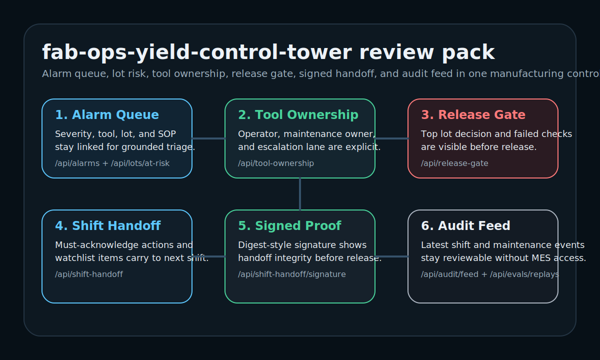

# Fab Ops Yield Control Tower

`fab-ops-yield-control-tower` is a service-grade manufacturing operations demo for semiconductor and industrial environments. It keeps `alarms`, `lot-at-risk prioritization`, `tool ownership`, `release gate`, and `shift handoff` in one reviewable operator surface.



## What it demonstrates

- Fab control tower framing instead of a generic AI copilot
- Alarm -> lot -> tool -> SOP linkage for grounded triage
- Shift handoff export surface for operator continuity
- Tool ownership, release gate, audit feed, and signed handoff proof
- Recovery board that separates hold, watch, and release-ready lots
- Replay-style review evidence for manufacturing incident scenarios
- Service-grade runtime brief, review pack, schema endpoints, and CI

## Review Pack At A Glance

- Tool ownership and maintenance escalation lanes stay visible before any release decision.
- Release gate makes the top lot decision explicit instead of implied by the alarm queue.
- Recovery board compresses release posture into hold/watch/ready lanes before the handoff is exported.
- Shift handoff now includes a digest-style signature proof for next-shift review.
- Audit feed shows the latest handoff and escalation events without live fab systems.
- The landing screen now supports focused tool and lot selection, so reviewers can swap the control-tower route they inspect instead of relying on one hard-coded example.

## Quickstart

```bash
python3 -m venv .venv
source .venv/bin/activate
python -m pip install -U pip
python -m pip install -e ".[dev]"
uvicorn app.main:app --reload
```

Open `http://127.0.0.1:8000`.

## Service-Grade Surfaces

- `GET /health`
- `GET /api/meta`
- `GET /api/runtime/brief`
- `GET /api/runtime/scorecard`
- `GET /api/review-pack`
- `GET /api/recovery-board`
- `GET /api/recovery-board/schema`
- `GET /api/schema/alarm-report`
- `GET /api/schema/shift-handoff`
- `GET /api/fabs/summary`
- `GET /api/tools`
- `GET /api/tool-ownership`
- `GET /api/alarms`
- `GET /api/lots/at-risk`
- `GET /api/release-gate`
- `GET /api/shift-handoff`
- `GET /api/shift-handoff/signature`
- `GET /api/audit/feed`
- `GET /api/evals/replays`

## Review Flow

1. `health`
2. `runtime brief`
3. `recovery board`
4. `tool ownership`
5. `release gate`
6. `alarm queue + lots at risk`
7. `shift handoff + signature`
8. `audit feed + replay evals`

## 2-Minute Review Path

1. Open `/health` to confirm critical-alarm and replay surfaces are available.
2. Read `/api/runtime/brief` for the control-tower contract and current ops snapshot.
3. Inspect `/api/recovery-board?mode=hold` to isolate the lot that blocks release posture.
4. Use the landing-screen selectors or inspect `/api/tool-ownership?tool_id=etch-14` and `/api/release-gate?lot_id=lot-8812` before trusting release posture.
5. Review `/api/shift-handoff` and `/api/shift-handoff/signature` before handing the queue to the next shift.

## Proof Assets

- `/health`
- `/api/recovery-board?mode=hold`
- `/api/tool-ownership?tool_id=etch-14`
- `/api/release-gate?lot_id=lot-8812`
- `/api/shift-handoff/signature`

## Local Verification

```bash
python -m pip install -U pip
python -m pip install -e ".[dev]"
python3 -m compileall -q app tests
python -m pytest
node --check app/static/app.js
```
