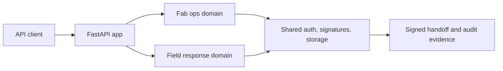

# Technical Review Pack

## System Boundary

This repository models manufacturing operations APIs for alarm triage, lot risk, release gates, recovery state, and signed shift handoff. The service uses deterministic data and local persistence so the API behavior can be tested without external infrastructure.

## Architecture Notes



The two domains share infrastructure while keeping domain-specific rules isolated. This prevents duplicate security and signature logic.

## Demo Path

```bash
make install
pytest -q
python scripts/exercise_runtime.py
```

Useful entry points:

- `app/main.py`
- `tests/test_fab_ops_domain_logic.py`
- `tests/test_scanner_domain_logic.py`
- `tests/test_service_ui_contract.py`
- `scripts/exercise_runtime.py`

## Validation Evidence

- Tests cover API behavior, domain logic, shared modules, AWS export envelopes, and site contracts.
- Runtime exercise script validates the service path.
- Handoff outputs are signed for tamper-evident review.

## Threat Model

| Risk | Control |
|---|---|
| Release gate drift | domain logic tests |
| Handoff tampering | signed envelopes |
| Shared utility regression | shared module tests |
| External dependency fragility | deterministic local data path |

## Maintenance Notes

- Keep domain-specific rules out of shared infrastructure.
- Add tests for every new release gate reason.
- Keep example data synthetic and deterministic.
- Preserve signed evidence compatibility.
